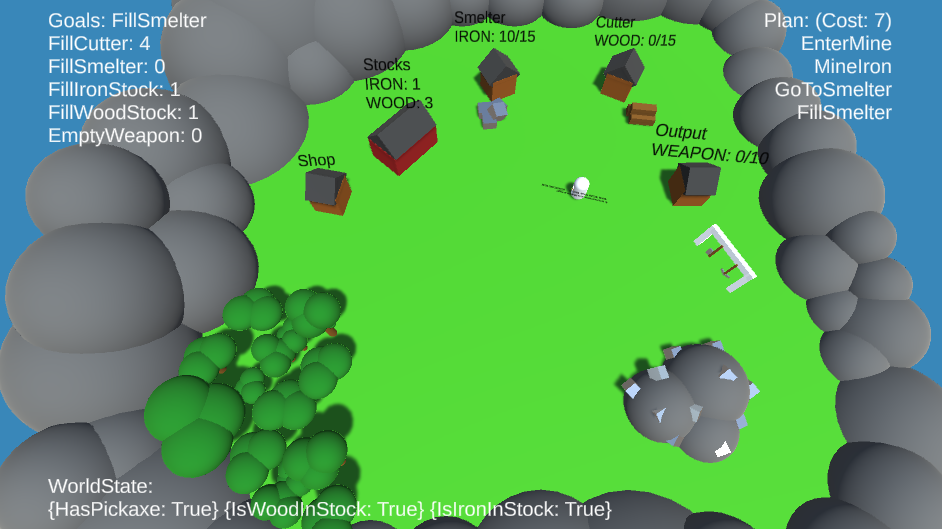
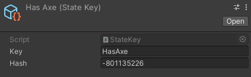
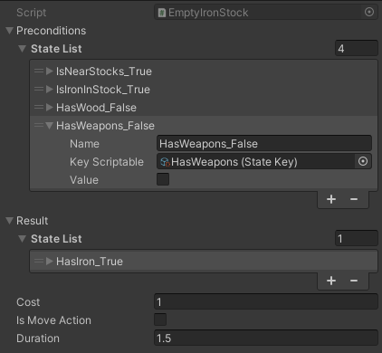
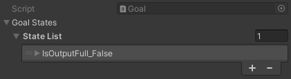
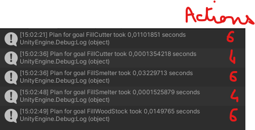

# *Spline*: *GOAP Planner* - **Unity/C#**
### ISART DIGITAL GP3, School Project: *Lancelot MARÉCHAL*  

 

<!-- ABOUT THE PROJECT -->
# About The Project 
**Built with Unity 2021.3.5f1**

The goal of the project is to make a AI planner of type GOAP.

# Table of contents
- [Details](#details)
    - [Project]( #weaponsmith-project)
    - [Architecture](#architecture)

## Issues
Due to the cooldown between Goal priority updates, the AI can sometimes finish a goal and be lost until the next.

---
# Details

To have the first version of the project corresponding to the states, actions and goal asked for open *Scenes/FirstExercise.scn*\
This was just a test to get used to the system and learn a bit more about the GOAP before doing the actual project.
The plans are only return in the console.

The *Scenes/WeaponSmith* is a more advanced project. With multiple goal, execution of the plan with display.

## WeaponSmith Project

There are 5 Goals:
- Fill the Smelter with Iron ({IsFillingSmelter = true})
- Fill the Cutter with Wood ({IsFillinfCutter = true})
- Fill the Stocks either with Iron or Wood ({IsFillingIronStocks = true} or {IsFillingWoodStocks = true})
- Empty the Weapon Output ({IsOutputFull = false})

There are 22 Actions and 19 States that can be found in *Annexes/Goals-Actions-States.xlsx*

## Display

- Top Left: "Goals:" the current Goal. And all the goals with there current priority (sorted by priority)
- Top Right: The current plan with its cost and the list of actions
- Bottom: The states in the WorldState that are currently true (to avoid diaplying all 19 of them as the same time).

## Architecture

### StateKey
A *StateKey(.cs)* is a scriptable object. It takes the name of the Scriptable instance for the name and create the Key with a Hash of this name. This is more versitile than an enum as I can add or remove any state at any time.\
It's also better than just giving a string:
- it's faster to compare the hashes (int) than string
- there is not risk to make a typo which would be the case if I had to put the same string to everything that need the state

*Key* is determine by the name of the Scriptable instance
*Hash* is the hash of the Key. This is what is used by the planner to compare the states.  
 

### State
A *State(.cs)* is just a StateKey and a value.  
 

### States
A *States(.cs)* has a list of *State.cs*. It has all the method to compare, change any of its state.\
This is the class used for the WorldStates.

(I know the names *State* and *States* can be confusing)

There is a global WorldStates that has all states relative to the world on the *WorldManager(.cs)*.\
And an other WorldStates on the *Character(.cs)* for all states relative to a specific Agent.

The *Character(.cs)* also has a WorldState that is a concatenation of those two (as the State is a class in a List in the States (WorldStates) they are reference and changing a State in the global WorldState also change it in the complete WorldState).  
 

### Action
An *Action* is also a scriptable object. This way I can easily tweek it at any time and give it to my *Character.cs*.\
If I had multiple characters I would need to do copies of those scriptables as they take the Character as reference or to only send the Character when necessary to the Action's method.\

*Preconditions* and *Result* are *States.cs* to which one can give any *State.cs*\
The *State(.cs)* take the name of the chosen one + the value given to it for a simpler reading of the list.\
The *Cost* is ths base cost of the action.\
*Is Move Action* ditermines if the action induce a movement this is mainly use to reduce the planning time (Cf. [Planner](#planner)).\
*Duration* is the duration of the action when executed (not taken into acount for the Move Actions as their duration is just the time the Agent takes to reach his destination).

*State*:
- *Name*: This is determine by the name of the StateKey and the Value and can't be change manually it is only displayed so that the Element name is changed (Unity names Elements, Element i unless they have a string as first Serializable field).\
- *Key Scriptable*: Reference to the *StateKey* scriptable
- *Value*: The required value (for preconditions) or the value that will be updated (for results)  
 

### Goal
A *Goal(.cs)* just has a *States.cs* and a priority. The priority of the Goal is set in the *WorldManager.cs* as they are dependent on the filling percentage of the different storage and are not relative to the Agent.

  
 

### Planner
Planner is a static class that has the required functions to create plans and return the best to the Character.

The GetGraph function is based on the pseudo-code given in the course with small tweaks to get better performances.
The time taken to create a graph is displayed in console.

There are two main optimisation:
- Prunning: Once a branch reach is leaf, I save the Cost of the leaf and I stop the parsing of any branch that would have a Cost greater than this before it reach it's leaf. This way I avoid lots of recursion of the function. (Credit to Rémi Giner for the idea).
- Movement: If the parent action is a movement action, the next action can't be a movement action because it would mean the parent action is useless (moving twice without doing anything in the meantime).

This helps me keeping a planning time low.\
\
The reason why there are two times each plans but with less actions is explain in the next section [Plan](#plan).  
 

### Plan
After a plan is set, the Character execute it in a Coroutine (so it's async) to wait for the actions (especially move Actions) to end before doing the next.

After a plan is fully executed if no other goal takes priority, the plan is launch again.\
However this means that some actions done in the first execution could be useless in the second.\
To avoid that, I try to replan for the same goal but with only the action previously used.

For exemple here, if the first to actions are useless has the Character already has the Pickaxe.\
So it will be replanned to:

With only the 6 same actions given to replan (so it's really not expensive).
If the plan was the most optimised it will just end up being the same once replanned.

If the planning fail it means even the previous plan is not possible anymore so I replan for the same goal but with the full set of actions.

This goes on until a new goal takes priority.  
 

### Execution
At the execution of the plan. The action are not changing the WorldState.  
Because they would do it either at the beginning of the action or at the end and this is an issue for the move actions:
- At the beginning, the Agent hasn't reach his destination so I can't set the corresponding IsNear*Location* state to true in case the plan is aborted.
- At the end, the Agent has long left the previous destination so I need to set the corresponding IsNear*Location* state to false when he just left and not wait for him to reach his new destination.

This is the reason why the WorldState is changed separatly:
- through the WorldManager, by the Storages for their corresponding Is*Storage*Full state.
- through the Character, by the Storages for their corresponding IsNear*Location* state.
- through the Character, by the Agent Inventory for the Has*Resource* states.

All the IsFilling*Storage* states are not changed (only theoretically by the Planner when planning).